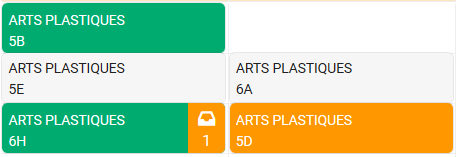
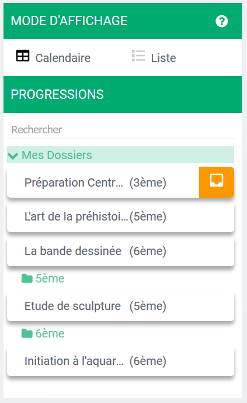
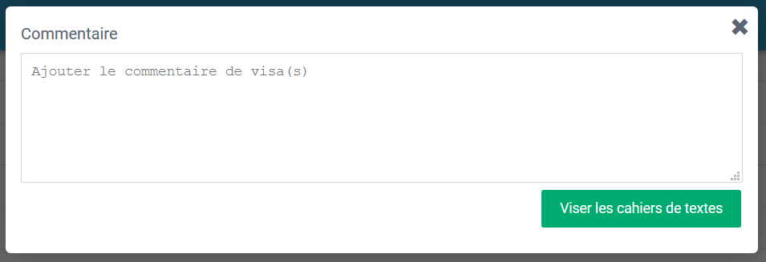
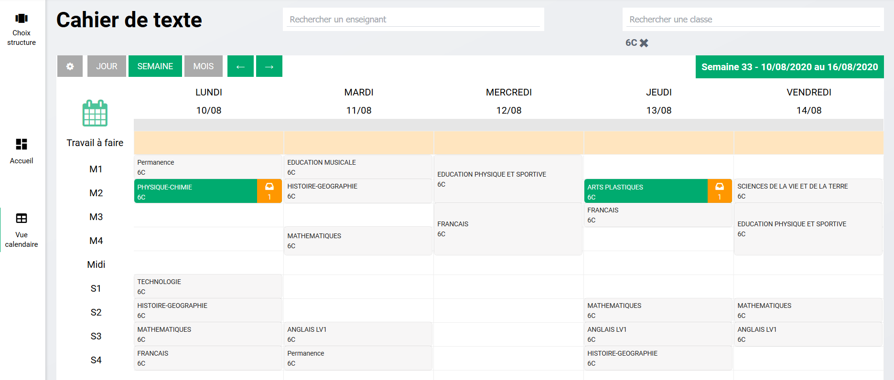
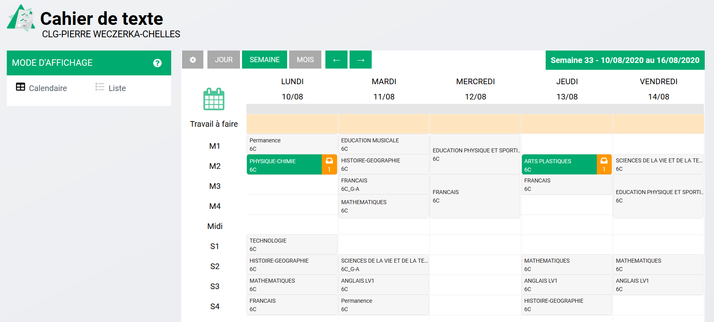

# Cahier de texte

Le cahier de texte est un module qui permet, selon les profils, d'accéder ou de créer des séances, des devoirs.
Il permet aux parents et élèves de **suivre les devoirs et séances remplis par les enseignants.**
Il permet aux enseignants de **gérer tout leur cahier de texte** : création, modification, création de progressions...
Il permet **à la vie scolaire d'accéder aux cahiers de texte pour aider les élèves et à la direction de viser les cahiers de texte.**

#### Table des matières

<!-- TOC depthFrom:2 depthTo:3 withLinks:1 updateOnSave:0 orderedList:0 -->

- [Profil enseignant](#profil-enseignant)
	- [Vue calendaire](#vue-calendaire)
	- [Liste des cahiers de texte](#liste-des-cahiers-de-texte)
	- [Progressions](#progressions)
- [Profil Vie Scolaire](#profil-vie-scolaire)
	- [Liste des cahiers de texte](#liste-des-cahiers-de-texte)
	- [Vue calendaire](#vue-calendaire)
- [Profil Parents et élèves](#profil-parents-et-%C3%A9l%C3%A8ves)
	- [Vue liste](#vue-liste)
	- [Vue calendaire](#vue-calendaire)

<!-- /TOC -->

## Profil enseignant

### Vue calendaire

La vue calendaire est la vue par défaut du cahier de texte des enseignants. Elle affiche l'emploi du temps de l'enseignant connecté et donne accès aux principales fonctionnalités.

Légende des couleurs :
- **vert** : une séance a été saisie
- **orange** : un travail à faire a été saisi pour ce créneau
- **vert et orange** : une séance et un ou plusieurs devoirs ont été saisis sur ce créneau

#### Créer des séances et devoirs

##### Les différents accès
Pour créer un devoir ou une séance, il existe plusieurs moyens :
- depuis les boutons en haut à droite
- en cliquant directement sur la séance concernée dans le calendrier
- en glissant-déposant une séance du bloc progression vers un créneau

Chacune de ces actions ouvre une fenêtre permettant de saisir plusieurs informations.

##### Créer une séance

Si l'ajout de séance a été réalisé en cliquant sur un créneau, la classe et la discipline sont pré-remplies, sinon il faut choisir.

Il faut encore compléter :
- **Un titre** : par défaut Séance + date du jour
- **salle préremplie** avec l'emploi du temps
- **type de séances** (ces types sont paramétrés par la vie scolaire)
- **date du jour pré-renseignée**
- bouton de **publication** : activé par défaut (possible de le désactiver pour rentrer des séances et devoirs en avance sans que les autres profils le voient)
- **description** : il s'agit de l'éditeur de texte présent partout sur l'ENT

Un bouton **"Ajouter un travail à faire"** permet de poursuivre la saisie d'un travail, d'un devoir.

##### Ajouter un travail à faire

Pour cette section, il est possible de saisir un travail :
- **pour une échéance** : séance (par défaut celle en cours) ou date
- **pour une ou plusieurs classes, groupes**
- **pour une discipline spécifique** (si l'enseignant est multidisciplinaire)

Il est possible aussi d'ajouter :
- un **type de travail** (paramétré par la vie scolaire)
- une **durée** estimée

Une fois le travai validé, un **tableau récapitulatif apparaît**.

#### La recherche

En tant qu'enseignant il est possible d'afficher les cahiers de texte d'autres enseignants et d'autres classes. Il faut pour cela choisir l'enseignant ou la classe dans **les champs de recherche situés en haut de la page.**

### Liste des cahiers de texte

Sur cette page **sont recensés tous les cahiers de texte** saisis par l'enseignant pour toutes ses classes avec des informations sur la dernière modification, le nombre de séances contenues dans le cahier de texte, et l'état s'il a été visé ou non par la direction.

**En cliquant sur les lignes**, le cahier de texte s'ouvre et met à disposition toutes les séances et devoirs rattachés à ce cahier de texte.

En cliquant dessus, **la séance ou le travail s'ouvre dans une fenêtre et il est alors possible de naviguer de l'un à l'autre à l'aide de flèches de navigation**.

### Progressions

Il est possible dans ce module d'anticiper son travail de saisie des séances et éventuellement travail à faire. Au sein de Progressions, l'enseignant peut créer des dossiers et y ranger des séances non publiées, qu'il pourra ensuite glisser déposer dans la vue calendaire.

#### Créer un dossier

La création d'un dossier se fait depuis le **bouton "Créer un dossier"** dans l'arborescence à gauche.

**Ce dossier correspond à une progression** dans laquelle, il est alors possible de créer des séances en anticipation.

#### Créer une séance

Pour créer une séance, il suffit de **cliquer sur le bouton "Créer une séance"en haut à droite.**

Une fenêtre s'ouvre avec les mêmes champs à remplir que depuis la vue calendaire.

Une fois la séance enregistrée, elle apparaît dans le dossier dans lequel l'utilisateur était positionné. Cette séance se retrouve ensuite dans **le bloc de gauche sur la vue calendaire.**

Ainsi, il est possible de **pré-remplir des séances dans Progressions pour ensuite les glisser-déposer dans la vue calendaire pour plusieurs classes** et ainsi gagner du temps.

## Profil Vie Scolaire

Les équipes de la Vie scolaire et les fonctions Direction disposent de droits différents sur ce module, principalement liés à de la consultation et à des actions de contrôle.

### Liste des cahiers de texte

La vue par défaut des équipes de vie scolaire est la vue Liste des cahiers de texte.

Elle propose : **une ligne par enseignant et par classe** : chaque ligne est donc un cahier de texte.

En cliquant sur la ligne le détail s'ouvre et il est alors possible de consulter les séances et devoirs de ce cahier de texte.

Si le personnel connecté dispose des droits, il lui est possible de **viser un cahier de texte**. Pour cela, il faut sélectionner le cahier de texte. Un menu apparaît en bas qui permet de sélectionner "Viser".

Une fenêtre s'ouvre pour entrer un commentaire et viser.

### Vue calendaire

Il est aussi possible pour l'équipe de vie scolaire de **consulter la vue calendaire des cahiers de texte**. Cela permet notamment d'accompagner des élèves qui en auraient besoin.

Sur cette vue vide par défaut, il est **nécessaire de sélectionner un enseignant et/ou une classe** pour en afficher le cahier de texte.

## Profil Parents et élèves

Les parents et élèves peuvent accéder au module cahier de texte pour y consulter les séances et devoirs à faire.

### Vue liste

La vue par défaut des profils Parents et élèves est **une vue liste qui proposent les prochains devoirs à faire** sur les 15 jours à venir.

Il est toutefois possible d'apporter des **modifications** à cette liste à l'aide de différents filtres :
- filtre de **dates modifiables** : il est donc possible de revenir en arrière **(1)**
- **affichage des devoirs à faire uniquement et/ou des séances** **(2)**
- filtre de **discipline** **(3)**

En cliquant sur un travail à faire ou une séance, celui-ci se déplie pour dévoiler son contenu mais il est aussi possible de l'afficher en grand en cliquant sur **"Voir"** **(4)**.

Le **profil élève uniquement peut noter le travail comment ayant été effectué** **(5)**. Les parents voient juste l'état validé ou non par leur enfant.

Si la vue liste n'est pas assez lisible, il est possible pour les profils Parents et élèves de **basculer sur une vue calendaire** **(6)**.

### Vue calendaire

Cette vue propose l'emploi du temps de l'élève. Avec un jeu de couleur, il est facilement aisé de voir les séances remplies ou les devoirs à effectuer.

Légende des couleurs :
- **vert** : une séance a été saisie
- **orange** : un travail à faire a été saisi pour ce créneau
- **vert et orange** : une séance et un ou plusieurs devoirs ont été saisis sur ce créneau
